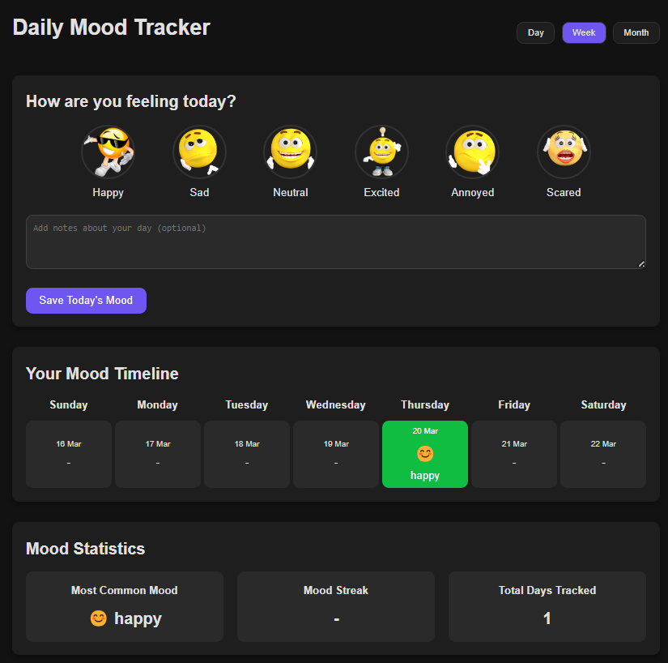

<h1 style="text-align: center;">Mood Tracker: Save & Visualize Your Daily Emotions</h1>

<h2 style="text-align: center;">Mood Tracker Preview</h2>

 

<h5 style="text-align: center;">Mood Tracker Preview Daily</h5>

<h5 style="text-align: center;">Mood Tracker Preview Weekly</h5>

<h5 style="text-align: center;">Mood Tracker Preview Monthly</h5>

### **Key Features of This Project**

1. **Saves Mood Data in Browser**

   - Your mood is saved in the browser using **localStorage**.
   - Even if you refresh or close the page, your mood history remains safe.

2. **Different Timeline Views**

   - You can see your mood history **daily, weekly, or monthly**.
   - Each view shows the moods recorded for that time period.

3. **Calendar View**

   - A **monthly calendar** where your moods are shown with emojis.
   - Today’s date is highlighted for easy tracking.

4. **Clean & Organized Code**

   - The code is divided into **different sections** for better understanding.
   - Proper **comments and documentation** are added to explain how things work.

5. **Works on All Devices**

   - The design **adjusts automatically** for mobile, tablet, and desktop.
   - Uses **Flexbox and Grid** to keep everything in place.

6. **Better User Experience**
   - Mood colors make it easy to recognize past emotions.
   - A **Reset button** lets you delete all mood data.
   - Instant feedback is given when you record a mood.

### **How to Use This App**

1. Click on a mood emoji to save today’s mood.
2. Switch between **daily, weekly, and monthly views** to check mood history.
3. See mood patterns on the **calendar view**.
4. Click **Reset All Data** to delete your mood history.

---

### **Technologies Used (What Makes This Work?)**

1. **HTML (Basic Page Structure)**

   - Builds the structure of the webpage.

2. **CSS (Design & Layout)**

   - Styles the page (colors, sizes, layout).
   - Makes the page look good on **mobile, tablet, and desktop**.

3. **JavaScript (Main Functionality)**

   - Handles user actions (clicking, changing views, resetting data).
   - Saves and loads mood data.

4. **LocalStorage (Saves Mood Data in Browser)**

   - Keeps your mood data even after refreshing the page.

5. **DOM Manipulation (Changes Page Content Dynamically)**

   - Updates the page when you select a mood.
   - Shows mood history without reloading the page.

6. **Object-Oriented Programming (Better Code Organization)**

   - Code is divided into **small parts (classes)** to keep it clean and easy to update.

7. **Responsive Design (Works on All Screen Sizes)**

   - Uses **media queries** to adjust layout based on screen size.

8. **Event Handling (Detects User Actions)**

   - Detects when you **click an emoji** or **switch views**.

9. **Date Manipulation (Handles Time & Date Data)**

   - Uses JavaScript **Date object** to manage daily, weekly, and monthly views.

10. **CSS Variables (Easier Styling)**

- Stores **colors and theme settings** in one place for easy changes.

---

### **Final Note**

- Project for tracking your mood daily ! 😊

<!-- // ---------------------------------------- Disclamer --------------------------------- -->
<!-- Disclaimer by Ankit Raj -->
<!-- This project contains comments in HTML, CSS, and JavaScript files to help understand why each part is used. -->
<!-- The comments explain the purpose of different sections, making it easier to learn and modify the code. -->
<!-- Feel free to explore and improve the project! Happy coding! 😊 -->
